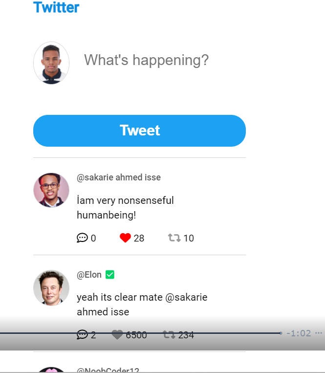

# myTwitterVersion

Welcome to myTwitterVersion, a simple Twitter-like web application built using HTML, JavaScript, and CSS. This application allows users to post tweets, view them in a feed, and interact with other users' tweets.

## Screenshots


*Caption for Screenshot 1*

- Post tweets with a character limit.
- View the list of posted tweets in a feed.
- Like and comment on other users' tweets.
- Responsive design for different screen sizes.

## How to Use

1. Clone this repository to your local machine:

```bash
git clone https://github.com/sack-ali/myTwitterVersion.git


